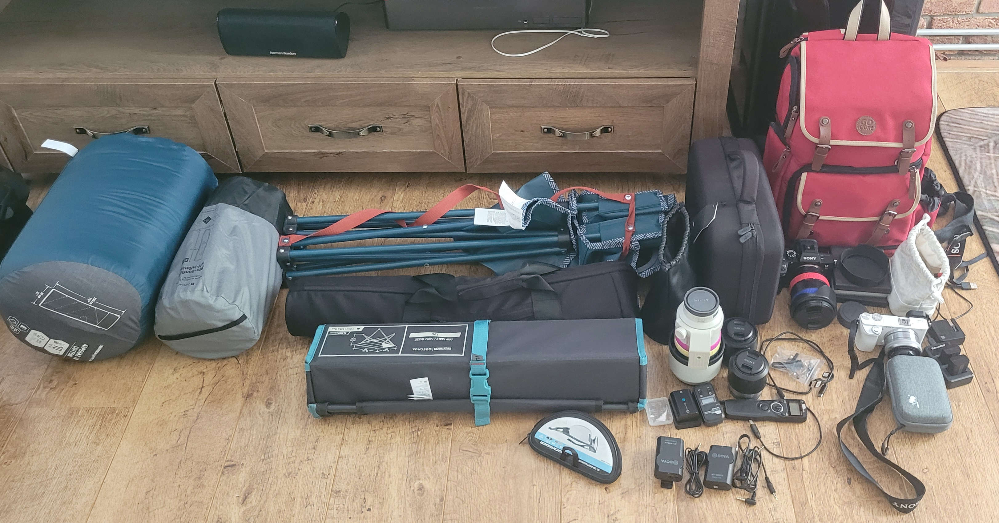
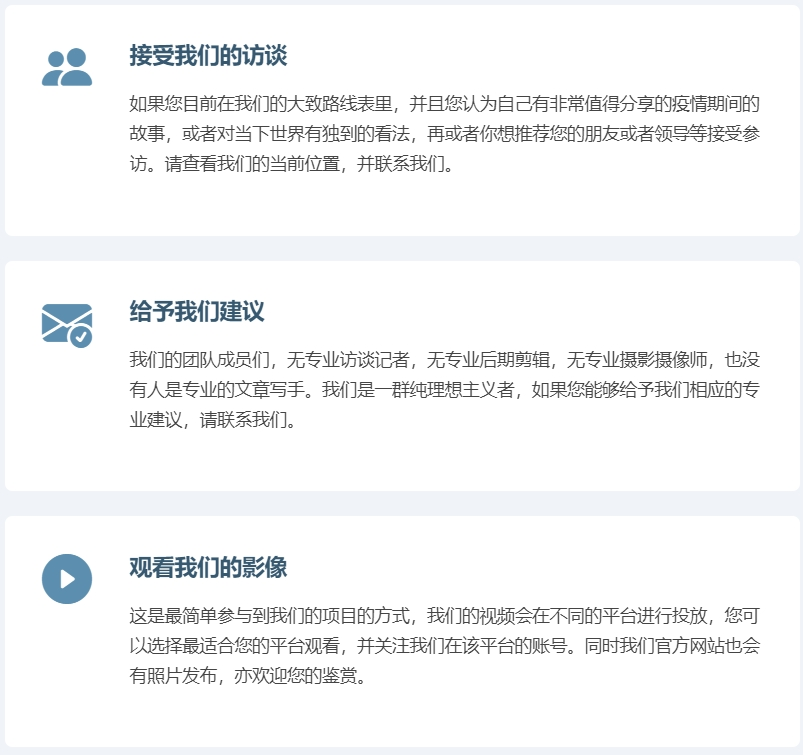
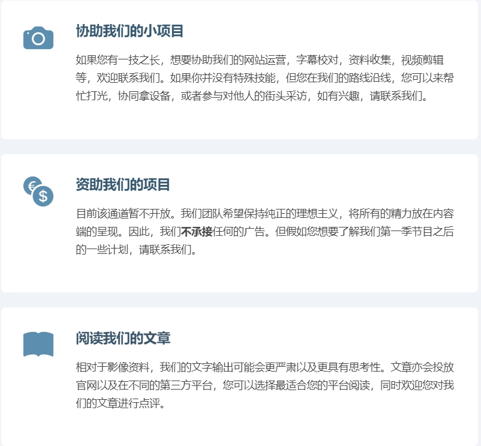

## 世界真的变得更糟糕了吗？

​	【先导预告片在文末】	

​	我是罗艺峰，明年就要30岁了，目前在荷兰鹿特丹。从某种意义上讲，我就是前段时间网络上热议的”小镇做题家“。我来自四川省江油市中坝镇，一个西南地区的”五线城市“。幼年时母亲在镇上的金轮市场(10年前已拆)卖冬瓜，我的很多童年记忆，都来自于那个水泥板和棚户顶的农贸市场。幼年时期的成长经历大部分是充满着现实主义的，后来也算是通过“小镇做题家”的路进入了大学，再后来亦出国留学，再回国工作等。我也不知道为什么，<u>进入时期后的我</u>，变得非常理想主义，也做了很多理想主义的事情。而现在，我准备在自己即将而立之年的时候，再做一件理想主义的事：**我想要在没有投资人和非常专业的团队的情况下，做一部有关于后疫情时代的人文访谈纪录片。从人口稠密的西欧出发，一直到人口稀疏的北极圈。我想要去探索一个问题：这个世界真的变得更糟糕了吗？** 我的团队成员们没有人拿工资，他们也都有自己的工作，但是大家都愿意做一次理想主义的尝试。在经过了将近4个月的筹备与发出了上百封访谈邀请邮件后，我终于将于2022年8月8日开始这趟理想主义的行程。

​	

​		为了使这个项目能有更多人的参与，我制作了项目的官方网站： https://www.iampossible.cn/ 。 这篇文章是项目正式开启前所写，所以我想谈一谈这个项目的背景与为什么要做这个项目？

​		首先，这个项目的中文名是**行路摘星辰**，我们的价值观是**“歧路今安在，愿可摘星辰“**， 取自李白的两首诗，《行路难》中的“多歧路，今安在？”与《夜宿山寺》里的“危楼高百尺，手可摘星辰”。寓意当今世界是复杂而割裂的，而真正的“大道”在哪里呢？希望能够通过行走（实践：包括田野调查和访谈）的方式，来认知世界，摘下星辰。而英文名我取为**IMpossible**，看起来这个词是impossible(不可能)，但是前面两个字母是IM(我)，而后面其实是possible(可能)，寓意为我能够将不可能变成可能。

​		史蒂芬·平克在《当下的启蒙》里通过多个角度的实证数据论证出 **“世界变得越来越好了”** 。比如，在过去的几百年历史中，人类的平均预期寿命大幅提高，孩童的营养状况以及教育水平得到改善，人们的工作环境普遍得到改善等等。但是，书中也引用2015年底的一项民意调查，其结果显示大部分人都认为 **“世界正在走下坡路”** 以及 **“这个世界变得越来越糟糕”**。 而2015年底的这项民意调查主要是在14个发达国家进行的，比如英国，丹麦，芬兰等。2020年爆发全球性的新冠疫情打乱了全世界的节奏。我想，如果现在再进行一次类似的民意调查，其结果应该会比2015年的那次更加悲观吧。

​		没有实证研究能表明过去两年多的诸多事件与疫情有直接的因果关系，但是疫情似乎又很像是一点火苗，点燃了世界的各个矛盾。放大了看，国际关系开始重新洗牌：俄乌战争迟迟不停，中美关系降至冰点，世界能源价格暴涨，欧美世界通货膨胀达到历史高位等。 而假如我们放至微观层面来看，就会发现更加可怕。因为，时代的一粒灰，落到个人头上就是一座山。也许三年前大家还只是在调侃“内卷”这个词并吐槽行业竞争越来越激烈，而现在市场已经实实在在开始淘汰一些行业和行业里的人了。国内很多年轻的打工人悲观地认为：2022年的互联网裁员潮不是终点，也可能只是刚刚开始。同时，由于新冠疫情，世界范围的文化交流变少，又由于世界局势变化导致的经济发展压力变大，整个世界的极左和极右思潮都开始泛滥。大家更愿意相信自己相信的那个部分，世界变得割裂起来。

​		在这样的一个时代，似乎对普通人一切都变得比原来更难了。上升通道变窄，国际局势不稳，生活压力变大等等。我们应该用怎样的态度去面对呢？它山之石可以攻玉，我们是否可以通过对不同的人群的深度对话去找到一些方向与答案呢？而这个世界，真的变得更糟糕了吗？我想，通过《行路摘星辰》第一季的探索，或许我们能够得到一些答案吧。 

​		在整个项目的准备期，我们受到了很多质疑，但更多是得到了同样是理想主义者的支持，我们的LOGO是来自北京的李海毓女士设计并赞助的，我们的网站的一些修改意见是来自挪威的Shi Chen女士与IT私塾的李巍老师尽心尽力解答的。我们的先导片拍摄是王垒先生和贺思贤同学作为志愿者帮忙拍摄的。我们的所有的受访者都是免费受访，并在前期交流沟通中为我们提供了诸多的意见的。还有许多的朋友，自愿加入到宣传与帮忙的队伍，我们都表示诚挚的感谢。我们将在每一期节目都打上相关致谢，同时在我们网站的末端，添加了一个致谢名单，仅以我们的绵薄之力向所有理想主义者们和参与到这个项目的朋友们表示感谢。 

​		明天就要出发了，担忧而又兴奋。担忧自己的能力不够，辜负大家的期望。兴奋这个理想主义的项目终于要正式开启。最后，真心希望有更多朋友能参与到这个理想主义的项目中来。正如我们的官方网站上所描述的，你有多种方式可以参与到我们的项目中来。 

​		

		

​		最后，歧路今安在，愿可摘星辰。我是罗艺峰，我们一同上路！

​		

## Levente: 只有变糟糕的人，没有变糟糕的世界

【中间的配图很多是可以从视频里截取的，但是我目前没有时间搞】

​		酗酒，药物，家庭暴力，父母双亡，东欧前社会主义国家。如果将这些元素全部都组合在一起，会造就怎样的人呢？似乎没有任何一点能让我建立起相对积极的想象。但是我在荷兰马斯特里赫特遇到了一个人，将以上元素全部收入囊中，但他却积极且自律。

​		在没有见到李文之前，我和所有其他人一样对他的印象都停留在他是一个环球搭车客和沙发客这件事情上。他在著名的沙发客网站CouchSurfing上有着将近500条评价记录。同时他也在简介里写了自己在过去的十多年里环游了世界，学会了8门语言。但是在与李文有了3天的相处与深度的对话后，我已经完全忘记他是一个环球旅行者的这件事。相反，我被他的思想所迷住了，我发现他在与世界沟通和与自处方面有着非常独到的方式。而这些，又恰恰是解决当前世界的普遍焦虑的良药。

​		在过去的几年里，我们在社交媒体以及公共领域有着许多有关原生家庭的探讨，有时候甚至有一点矫枉过正。仿佛成年之后的许多问题都能够用原生家庭阴影这几个字来盖住。而李文的原生家庭，似乎集结了90%的不幸。他出生的背景是苏联解体，罗马尼亚社会主义共和国政权更迭。父母有着酗酒吸毒和暴力史，家庭暴力伴随着他的童年。在他12岁时，他的母亲便抛弃了他，他继而和祖父母一起生活，但是祖父母亦有着酗酒的习惯。在他大约成年的时候，父母均因为酗酒而死亡，不久后奶奶也去世，爷爷瘫痪在床。可以说李文几乎没有所谓的欢乐童年可言。但他并没有因此而变坏或者沉沦，**他在成年后突然意识到：“为什么我要背负家族的这一切的负面？为什么我就不能有我自己的人生呢？”** 也是在那时他了解到了沙发客和搭车旅行，这为这个罗马尼亚的穷苦年轻人提供了去看世界的机会。他在之后的人生里，几乎一直是在路上，他的足迹遍布全球。他在亚马逊丛林里和原始部落的人一起生活，他在东南亚和当地渔民一起打渔晒鱼，他在南美洲和那里的年轻人夜夜桑巴。而在长达11年的旅行中，他精通了8门语言，他已经不再是那个罗马尼亚黑海边的小镇青年，而是一个见识了世界多样性的内心丰满的成年人。

​		去看更大的世界给李文打开了一扇窗，他不在执著于自己童年的不幸，**因为他已经看到了这个世界还有无数种可能性，人是可以选择自己要怎样过自己的人生的。**我知道有很多人会反对这个观点，觉得人可以真正做出选择的其实很少，但是否是因为我们在某些时候太过于贪婪，我们想要的东西太多，无法做出舍弃而使得我们困在了物欲的牢笼里呢？

​		李文并不是很想被人们总是谈论自己的旅行故事，因为人们只会惊异于：“Wow,他去过好多国家。 Wow，他几乎没有花钱就环游了世界。这个好酷”。 李文更想让人们知道，**并不是去过上百个国家这个数据应该被人关注，而是这过程中那些对他提供帮助的善意的人以及和他彻夜长谈开导他的人的故事应该被人关注，因为这些才是塑造了今天的他。**这其实和我自身的经历产生了极大的共鸣，我在18岁的成人旅行的时候，新闻报道更多强调了我仅仅花了350元钱搭车旅行2200公里的这件事，而忽略了整个过程中的人和事对于一个18岁的少年的价值观塑造。我至今也无法忘记2011年在内蒙古乌海的那位大哥和我讲了一夜北漂的故事，也无法忘记在宁夏固原与一位阿訇长谈回族在当地的生存状况等等，这一切都为那个18岁的少年打开了认识世界的大门。

​		（前面似乎扯多了有点远，这段该怎么圆回来暂时没想好，直接开写了）

​		在与李文相处的3天中，我们花了两个上午只做体能训练，没有做采访。这也是他的生活中不可或缺的一部分。他所有的训练方法都是自己读科研文献和书本收集起来的。他自己总结出来的训练手稿足有厚厚的一本。他在与我阐述身体训练的一些理念时，我有一种在听大学教授讲课的感觉。而这让我想到了马特达蒙的一部电影《心灵捕手》，该片中有一句经典的台词：“你在MIT里学到的所有东西，只需要花2美元就可以在公共图书馆里得到。而你在乎的却是花上万美金得到的文凭而已。” 我并不否认文凭的重要性，但是对于我们自身要做出的事与选择，似乎并不需要专门去参加科班训练。【写到这脑袋不是那么灵光了，所以尽量你们来提取信息】

​		李文的挺多思想都具有一定的哲学性，他甚至在他的名片上印上了李小龙的名言：“be water, my friend." 他非常欣赏李小龙的哲学思想与训练理念。我们并不是为了要更大的肌肉而显得好看，而是为了要让我们自身能更好掌控自己的身体，这是灵活性与爆发力的完美平衡，也是心智的flow(流动)如何让内心更为平静。他的训练场地非常简陋，是一个6平米的阴暗潮湿的地下室外加门前的一片空地。就是这样的训练场地，他改变了自己的身体。目前他精通柔道截拳道自由搏击。

​		【尽量升华的部分】：在这个物欲横流的时代，我们充满着对各种事物的焦虑。对工作的，对家庭生活的，对感情的。在疫情封控结束后，各地的离婚率都发生了倍数增长。这似乎是人们在当下的时代越来越无法自处与相处。每个人都在痛骂社会压力很大，处处充满焦虑，可是雪崩来临时，没有一片雪花是无辜的。我们既是这个焦虑时代的受害者，同时也是参与者。李文在访谈最后谈及是否认为这个世界变得更糟糕了。他的回答是：“这个世界可能变得更糟糕了，但是我并不是那么关注，我更关注我自身的训练，我自身的生活。“  这似乎充满了一种普世的东方智慧："各人自扫门前雪，莫管他人瓦上霜"。假如我们不去给流量明星增加流量，假如我们不去参与网络暴力，假如我们都把更多的精力花在关心自己的生活以及最亲近的人，这个世界，难道不就是已经变好了吗？

【有关于他的斯是陋室，惟吾德馨貌似没有太讲到，然后可能以上文字包含较多主题，你们尽量抽象提取。我实在事太多了，脑袋没法转那么快了】

## 尤利娅|如果没有战争，我已经在中国读研究生了

​		每一期的访谈，我都会最后问受访者一个主题问题：“你有没有觉得世界变得更糟糕了？” 而面对这个现在以难民身份生活在德国，且会讲一些中文的小姑娘尤利娅，我实在不忍心问她这个问题。与尤利娅相处的三天，亦让我重新复盘且重思了俄乌战争，重思了战争中人与人的关系，国与国的关系。我意识到现代战争可能已经不单单是军人的事了，有时甚至是一场互联网的狂欢。而这一切只会加重人类之间的矛盾与伤害。我自己也为战争爆发初期时一些不理智以及不负责任的想法感到愧疚。

**【1:尤利娅-美云】**

​		我与尤利娅的相识非常有趣。2022年7月30日，我与团队在荷兰鹿特丹拍摄《行路摘星辰》的先导预告片。结束拍摄时我们前往停车场取车，但发现停车场一侧的门已经关闭。这时几个看似学生的老外也走到这个已关闭的停车场门附近。于是我用英文给他们说:" the parking lot entrance may be at the other side."(停车场入口可能在另一侧)。 此时尤利娅用中文回复我说：“停车场呀，谢谢你。” 我大约花了15秒钟才反应过来这个金发碧眼的小姑娘是用中文回复我们的。于是我们折返和她继续攀谈。她亦告诉了我们更多有关自己的信息。

​		尤利娅是乌克兰XX人，刚从波兰XX大学毕业，主修XX，她的中文老师给她取名美云。美云在战争爆发前刚拿到了哈尔滨工程大学中文专业的硕士录取通知书。战争爆发后，美云所在的城市也受到了军事打击。因为乌克兰的成年男性不得离境，而美云的父母与10岁的小弟弟不会英文或其他西欧语言。又美云拥有着极强的语言天赋，她会乌克兰语，俄语，波兰语，部分德语与部分中文。所以家人决定让美云先逃离乌克兰，申请在德国做难民。

​		美云在德国暂住在一户老夫妇家，而那个城市离多特蒙德并不远，是我们第一季节目线路上的城市。于是我和美云互留了联系方式，相约大概两周后在德国见面，并做一期有关美云的专访。

**【2:美云专访】**

​		在对美云进行专访前，我和团队做了大量的有关这场战争的调研，我们似乎也把重点放在了美云对这场战争的看法以及对其他国家的态度的看法上面。我得承认这真是我们做过的最蠢的决定。

**【3:快乐的三天】**

​		到达美云所在的城市XXX的第一天，我们去政府安排的德语学校等美云下课，然后一起去吃中餐。整个过程

**【4:反思】**

​		在战争爆发初期，中文互联网上出现了一些非常不理性的声音，比如， 1）俄罗斯为什么如此拉胯，不是说好三天推平首都吗？ 2）乌克兰很多美女，我们可以接收啊。 3）难民有机会能润到西欧，可能本来也是他们想要的吧。 这些可能是调侃，也可能是无知，但其实互联网是联通的，这些声音其实也会传到乌克兰。而假如当这个世界最终回归和平，乌克兰的百姓又会怎样看待中国呢？乌克兰本地人又会怎样对待在乌克兰的中国同胞呢？而当我回顾历史，人类的仇恨，民族之间的伤痛，是很难消解的。

​		因为我们自己身处在一个大国，很多时候我们亦会情不自禁地代入大国视角想问题。我们会有“天下大势，分久必合合久必分”的宏大视角，但别忘了我们同时也应该拥有“兴，百姓苦，亡，百姓苦。”的情怀。在和美云相处的三天，我更多感受到的是这是一个22岁正值青春的小姑娘，她努力上进，有语言天赋。但她也爱美丽，有小脾气。抛开了国籍，她或许就是你父母口中的“别人家的孩子”。而当你面对这样一个像是你的姐姐或妹妹真实立体的乌克兰人的时候，你可能很难再说出那些不理智的言论了。

​		我们也许应该感谢先辈们的努力以及当下祖国的强大，使得我们的年轻人远离了战争。但我们也应该清晰的认识到：这个世界依旧不太平，很多国家和地区的年轻人无法享受教育，无法享受青春该有的快乐。也许我们没有足够的能力去改变什么，但是我们的先哲其实给了我们一个答案：**恻隐之心是仁，羞恶之心是义，恭敬之心是礼，是非之心是智**。

## 于博士：我只是想用科学的方式解释疫苗

​		最初的行程没有计划柏林站，因为如果要去柏林再到北欧，需要多绕路近600公里。所以于博士并不在我们的访谈人名录上。据于博士讲，他也是在一个朋友那听说了这个理想主义的项目，觉得一定要支持一下。当然，更重要的是，于博士自己的专业以及自媒体运营的频道，是和我们的主题非常相关的。于是，我改变了行程，决定绕路600公里去柏林和于博士聊一聊。

**【1.于博士何许人也】**

​		于博士在做自己的自媒体频道之前，已经是世界五百强之一的某医药企业的总监了，而他自己是十多年前到德国留学，在德国取得了医学的硕士与博士学位。目前暂时定居在柏林。而于博士的自媒体生涯始于2021年。在2020年疫情爆发后不久，各国都加速疫苗的研发。而在第一批疫苗于2021年提上生产日程后，海外的各类机构和媒体对中国生产的科兴灭活疫苗进行了诸多负面的报道。比如有效率非常低以及副作用很多等等。于博士仔细研究了海外机构的报道，他发现海外的机构用一种具有选择性的报道来误导了受众。比如，XXX。于博士当即决定要发出自己的声音。他在B站和YouTube都开通了自媒体的账户，并制作了一期节目《科兴疫苗如何？有效性与安全性不如辉瑞，阿斯利康，强生的疫苗？》，这个视频在全网有超过XX次的观看。而在这之后，于博士也继续制作了多条有关疫苗科普的视频。

[插图]

**【2. 镜头背后的于博士】**

​		于博士在自己的频道里一直都是专心做专业的科普，但其实在镜头背后，他也承受着一定的压力。因为于博士在视频中力挺了中国疫苗，所以在网络上一些对中国不怀好意的人就私信辱骂于博士。于博士最初并不是太能消化这些谩骂，毕竟做自媒体也不是他的主业。同时，他自己的事业已经非常成功，他也并不需要再用自媒体来为自己增加点什么。做医药领域的科普纯粹是希望想要给大家用更专业的视角去看待有些问题，并非要达成怎样的商业目的。而这些无端谩骂甚至会上升到诅咒家人的层面，这对于一个纯粹的科学家是很难接受的。于博士花了很长时间来消化这些信息

