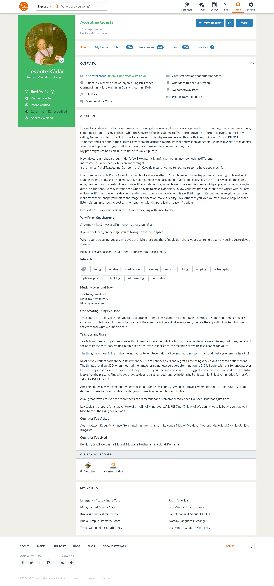

## 20220808-马城-Levente

2022年8月8日，我驱车前往马斯特里赫特，在这里我会去见已经预约好的一位沙发客。他的沙发客主页有467个评价（这个算couchsuring里的顶尖中的顶尖玩家了，1%），我把他的couchsuring的主页截图放在下面，你们可以阅读一下大概他的信息。他的自我描述还是写得比较详细的。而我自己和他的沟通与交谈中，我大概总结了几点他的人物画像：

1. 童年非常不幸，2岁时父母离异，跟了母亲，但是母亲酗酒吸毒，在12岁时母亲就抛弃了他。之后他跟随爷爷奶奶生活。一直生活到18岁，然后家人相继离世。（这期间他的父母一直都是处于酗酒吸毒状态，但他自己却并没有沾染这些习惯--我会在9号再挖掘一些）。他读了一年的大学后便辍学，开始长达11年的hitchhiking和沙发客之旅。足迹踏遍南美和东欧与东南亚。
2. 在11年的旅行期间，他熟练掌握了法语，德语，匈牙利语，西班牙语，齐切瓦语（马拉维和津巴布韦的官方语言），荷兰语。都是可以达到工作水平。
3. 在11年的旅行期间，他也沉沦过，就是那种南美年轻人每天喝酒，可卡因和抽大麻的生活。最后他的身体崩溃了，在某一段时间他连一支笔都拿不起来。也就是那个时候他决定要做出改变。他觉得他的身体给他发了信号了。
4. 当他5年前在马斯特里赫特定居后，他开始进行冥想，看书，他在看了李小龙的书后大受启发，开始开发自己的身体。并总结出一套自己的训练方法。-----目前他的身体非常好，在当地是小有名气的训练师。

## 20220809-马城-Levente

>这会儿是8月10日的清晨6点半，我基本要完成对Levente的访谈了，今天他的朋友要来和他say goodbye，我会最后再拍一些footage。这会儿我先梳理一下过去的两天到底发生了什么。因为这是第一站，我自己也没太多经验，所以导致了脑袋里的想法没能 全部实现。然后也并非所有的footage都能用。当然最重要的其实是来之前并不知道他身上的故事到底是什么。**接下来的这两天的简述，我就按照时间线来写，中途可能会写对应的视频素材是啥。** 

**我下面会直接链接素材视频，但因为素材视频并没有在IMpossible这个文件夹下，我使用的是绝对路径，不过也可以直接点击的啦，在typora里的点击也能看到路径**

8月8日我从鹿特丹出发，中途有拍一段开车行进的素材，后面30秒有风力发电机。[开车行进素材](D:\OneDrive\IM共享\视频CLIP\素材源文件\20220808马斯特里赫特\GOPRO\还没到马斯特里赫特\GX010018.mp4)。中途在蒂尔堡休整了2小时，本来想着去蒂尔堡森林里试拍一波，找找感觉，搞两个接访。结果的确也访谈了，但是人家一对小情侣在约会，最后不想入镜。 不过我在蒂尔堡的森林拍了一些空镜头和个人行走试拍，参见其中之一。[蒂尔堡森林空镜C0016](D:\OneDrive\IM共享\视频CLIP\素材源文件\20220808马斯特里赫特\蒂尔堡停留试拍\C0016.mp4)。

我大概是晚上6点到达马斯特里赫特李文的家(之后全用李文代替Levente)。他租住的地方在马城城边的农村，房子很破很旧，房租也很低（460欧一个月，两卧室一厅独立厨卫）。我和他简单交谈了半个小时，他做了饭给我吃，然后我俩决定去周边的一个小山丘看日落聊天，试访一次。那个小丘的风景很好，去的路上，我用GoPro拍摄了几条footage，[行走至小丘看日落Gopro](D:\OneDrive\IM共享\视频CLIP\素材源文件\20220808马斯特里赫特\GOPRO\GX010026.mp4)。大致内容就是行走时的交谈，他讲了他身体训练的一些理念。

等我们到了山顶的小丘，我们便开始第一轮的采访，我布置了三机位，一个机位拍我俩，一个机位特写他，一个机位作为花絮（GoPro）。 **这一段采访其实他讲话很快，然后内容质量不是特别高，因为我没能做到很好的引导，某些话题他讲了太多，有一部分是关于他的，有一部分是关于对世界的看法的，这一整段我觉得可以用的就几分钟**。 [山顶采访素材30min两人](D:\OneDrive\IM共享\视频CLIP\素材源文件\20220808马斯特里赫特\C0022.mp4)。 但是，最后的几分钟，我把相机移了位置，我在GoPro录的里面说了一段:“我们就享受日落吧”，然后画面里就只有两个人享受日落的，这一段我觉得是可以加旁白使用的。然后8号就结束了。

然后就到了8月9日，早晨我和他去进行了长达80分钟惨无人道的训练。所有的素材都在8月9日的清晨的训练里面。这里面可以挑出一些素材的。他下周就回罗马尼亚了，所以他邻居下午邀请他一个goodbye，都是荷兰语，我就自己进城了，然后有一个志愿者来帮忙。我就去马城拍了一些footage，也和这个志愿者聊了几句。志愿者：00后，本科一年级。基本没啥思想，所以那个访谈你也能看出，基本聊不出来啥）。

然后今天早晨，我准备拍摄一些footage，关于他的思想，今天的更有目的性，就是直击我们想要的一些主题，包括他的李小龙思想，包括他阅读的书等等。

## 20220810-马城-亚琛-LGBT

今天早晨李文的朋友来和他道别，因为李文下周二就回罗马尼亚了。他们道别的方式就是大家进行最后一次高强度的agility训练。在30度的高温下，来到马斯河边的一片空地上，90分钟的agility训练可以说是强度拉满了。我们总共进行了4个round的训练，我参与了前3个，最后一个round我对大家进行了拍摄。 这个部分的视频可以总结为以下：

| 编号                                                         | 内容                 |
| ------------------------------------------------------------ | -------------------- |
| [GoPro](D:\OneDrive\IM共享\视频CLIP\素材源文件\20220810马斯特里赫特\GoPro) | 只有4条，有我的画面  |
| [C0056](D:\OneDrive\IM共享\视频CLIP\素材源文件\20220810马斯特里赫特\C0056) | 周边环境的空镜       |
| [C0060](D:\OneDrive\IM共享\视频CLIP\素材源文件\20220810马斯特里赫特\C0060) | 李文特写奔跑         |
| [C0062](D:\OneDrive\IM共享\视频CLIP\素材源文件\20220810马斯特里赫特\C0062) | 几个人的训练一镜到底 |
| [C0064](D:\OneDrive\IM共享\视频CLIP\素材源文件\20220810马斯特里赫特\C0064) | 阳光空镜             |
| C0065-C0068                                                  | 几个朋友对李文的评价 |

结束训练后，我和李文回到他家，然后对一些问题进行了补拍，这个地方的采访稿主要是基于刘子琪给准备的内容。然后也补拍了关于他的地下室健身房和房间的介绍。同时也拷贝了李文自己的多年旅行经历的与一些他的视频素材。这个部分的视频可以总结如下。 

| 编号                                                         | 内容                                               |
| ------------------------------------------------------------ | -------------------------------------------------- |
| [C0071](D:\OneDrive\IM共享\视频CLIP\素材源文件\20220810马斯特里赫特\C0071) | 对李文的20分钟访谈，补充问题                       |
| C0073-C0077                                                  | 对李文的一些镜头补拍，包括他的地下室，他的阅读的书 |
| 打蚊子                                                       | 这段不知道放哪，是不是可以放在这期最末尾作为彩蛋   |

>这里插播一个东西，就是本来我对李文的采访结束后是要去科隆的，就是那个做商周青铜器的中国phd及他的导师，但是这个人突然一下子给我发了一个信息：我导师觉得没意思，我也觉得没意思，你另外找人吧。然后我立马回复她的时候，她已经把我删了。这时候帮我们拍摄先导片的小姑娘多方努力，帮我联系到了亚琛的同学。通过沟通，我决定去亚琛碰碰运气。

到达亚琛已经是下午6点了。我和要host我的两位小姑娘吃了饭，发现她俩是女同，且一位是新疆维族人，一位是山东人。【父母基本是反对态度或者不知道状态】然后和她俩详谈甚欢，想着说要不要就看看能不能采访一下LGBT的团体，然后晚上8点半到10点半，我们就开启了疯狂招人模式，最后这俩小姑娘帮我联系到了她们的某一个LGBTQ的前主席团成员，且这位成员是中国人，愿意出镜。

同时，今天晚上也和B站另一位up主通了电话，【于博士在德国】，他表示非常支持我们的项目，然后目前定了21号在汉诺威进行一次访谈。
