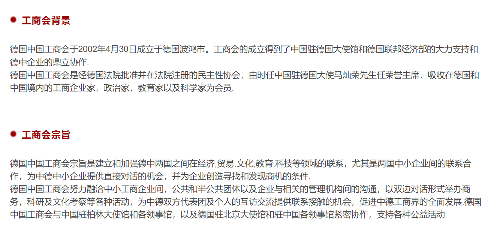

## 1. 基本信息

王颖Stella：德国中国工商会总经理

德国中国工商会官网: https://www.cihd.de/cn/

**自疫情以来，工商会组织的活动明显减少**

## 2. 访谈关注点

1. 中德工商会的简要历史。
2. 从中德工商会的发展历史简要谈及关于中德之间的商务往来发展史。
   1. 2002-2008左右主要是德国中小企业找中国供应商。
   2. 2014年之后主要是中国的企业到德国来找客户。
3. 疫情之前中德工商会的主要活动，疫情后中德工商会的主要活动。以及它们之间的对比。
4. 除了疫情对商务活动的影响，还有哪些其他因素影响着跨国商务活动。
5. 对于当前的商务状况，需要做出怎样的转型，才有可能找到新的突破口。
6. 王颖女士自身的简要经历。

## 3. 追加采访点

1. 今年6月，德国的经济部长哈贝克声明称，德国在今后与中国的交往之中将更叫关注“人权问题”。就在德国经济部长的声明之后没过多久，德国的一家企业提出的在华项目担保申请被经济部拒绝了。外交部长王毅同德国的外交部长也是进行了会晤。会议中，德国的外交部长并不否认德国对于中国进行所谓的“人权制裁”的举动。 **但是，我与多位在德企的德国朋友沟通，似乎德国的企业并不是很满意德国政府的这些做法或者经济制裁。他们依旧希望和中国保持非常良好的经济合作关系。你的感受是什么？以及你在做德国与中国的企业间的沟通时，有遇到类似的情况吗？即政府和企业的利益相斥。**

2. 上海机场里有个巨幅地图，其中欧洲有四个点。柏林，伦敦，巴黎，杜伊斯堡。且杜伊斯堡是最大的一颗红点。很多人可能不知道这个城市，但是知道rust belt或者鲁尔区。其实杜伊斯堡就是这样的一个城市。杜伊斯堡作为中国一带一路的重要布局城市，由传统工业城市到再次容光焕发。你觉得和一带一路的关系大吗？
   1. 在你接触的德国企业里，有多少德国企业家知道一带一路。
   2. 你是否认为一带一路会是目前中欧或者中德关系的一个粘合剂吗？
3. 如果让您给中国的投资者想要在德国进行投资或者创业的人说3点建议，你会说什么？
4. 我们不可否认当前的中欧关系不是几年前的那样蜜月期了，或者说整个世界目前趋于动荡了。你有觉得这个世界变得更糟糕了吗？
