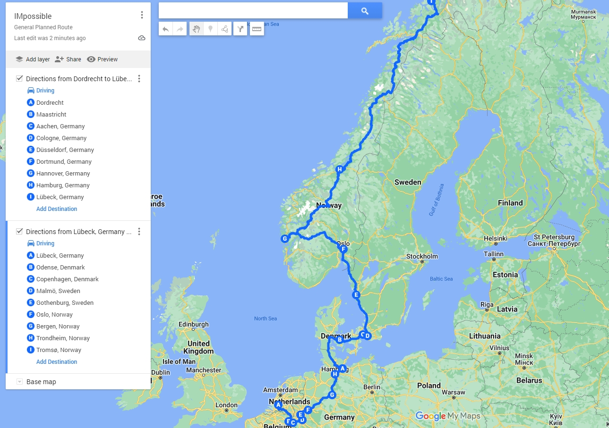

<a name="index">**目录**</a>
 
&emsp;<a href="#0">1. 项目介绍</a>  
&emsp;&emsp;<a href="#1">1.1 项目背景 </a>  
&emsp;&emsp;<a href="#2">1.2 项目内容</a>  
&emsp;&emsp;<a href="#3">1.3 项目核心</a>  
&emsp;<a href="#4">2. 项目实施</a>  
&emsp;&emsp;<a href="#5">2.1 项目准备</a>  
&emsp;&emsp;&emsp;<a href="#6">2.1.1 设备</a>  
&emsp;&emsp;&emsp;<a href="#7">2.1.2 采访文稿准备</a>  
&emsp;&emsp;&emsp;<a href="#8">2.1.3 平台宣传</a>  
&emsp;&emsp;<a href="#9">2.2 项目分工</a>  
&emsp;&emsp;<a href="#10">2.3 时间线</a>  
&emsp;<a href="#11">3. 应急预案</a>  
&emsp;&emsp;<a href="#12">3.1 行程变动</a>  
&emsp;&emsp;<a href="#13">3.2 住宿</a>  
&emsp;&emsp;<a href="#14">3.3 人物访谈</a>  
&emsp;&emsp;<a href="#15">3.4 安全问题</a>  

## <a name="0">1. 项目介绍</a><a style="float:right;text-decoration:none;" href="#index">[Top]</a>

我目前还没想好将这个项目中文名定为什么，因为感觉项目本身包含了许多方面，而英文名我取为IMpossible，看起来这个词是impossible(不可能)，但是前面两个字母是IM(我)，而后面其实是possible(可能)，寓意为我能够将不可能变成可能。在这个部分，项目背景，项目内容以及项目的核心将会被介绍。

在项目准备期，我的一些随机的思维漫步会记录在[思维漫步](Mind-wandering.md)。

### <a name="1">1.1 项目背景 </a><a style="float:right;text-decoration:none;" href="#index">[Top]</a>

​		史蒂芬·平克在《当下的启蒙》里通过多个角度的实证数据论证出 **“世界变得越来越好了”** 。比如，在过去的几百年历史中，人类的平均预期寿命大幅提高，孩童的营养状况以及教育水平得到改善，人们的工作环境普遍得到改善等等。但是，书中也引用2015年底的一项民意调查，其结果显示大部分人都认为 **“世界正在走下坡路”** 以及 **“这个世界变得越来越糟糕”**。 而2015年底的这项民意调查主要是在14个发达国家进行的，比如英国，丹麦，芬兰等。2020年爆发全球性的新冠疫情打乱了全世界的节奏。我想，如果现在再进行一次类似的民意调查，其结果应该会比2015年的那次更加悲观吧。

​		没有实证研究能表明过去2年多的诸多事件与新冠疫情有直接的因果关系，但是新冠疫情似乎又很像是一点火苗，点燃了世界的各个矛盾。放大了看，国际关系开始重新洗牌：俄乌战争迟迟不停，中美关系降至冰点，世界能源价格暴涨，欧美世界通货膨胀达到历史高位等。 而假如我们放至微观层面来看，就会发现更加可怕。因为，时代的一粒灰，落到个人头上就是一座山。也许三年前大家还只是在调侃式“内卷”这个词并吐槽行业竞争越来越激烈，而现在市场已经实实在在开始淘汰一些行业和行业里的人了。国内很多年轻的打工人悲观地认为：2022年的互联网裁员潮不是终点，也可能只是刚刚开始。同时，由于新冠疫情，世界范围的文化交流变少，又由于世界局势变化导致的经济发展压力变大，整个世界的极左和极右思潮都开始泛滥。大家更愿意相信自己相信的那个部分，世界变得割裂起来。[《美国小镇里的中年红脖子：在混吃等死中研究如何遏制中俄》](https://zhuanlan.zhihu.com/p/262704373?utm_source=wechat_session)里所反映的现象。 E.g., “中国人已经把5G芯片植入到口罩里了！赶紧扔了！不然致癌”  与中国社会中风靡的一些短视频里高呼的”留学生别回来了，回来就是传播病毒”是别无二致的。我分不清是互联网将曾经的无法看到的反智现象给放大了，还是信息的爆炸推波助澜了反智，也许他们互为因果吧。

​		那么，在这样一个对于普通人似乎一切都变得更加困难的时代，我们应该用怎样的态度去面对它？我们应该选择怎样的生活方式去面对这个时代？我们应该选择怎样的心境来达成自我的和解？我希望通过该项目来探索这些问题的答案。

### <a name="2">1.2 项目内容</a><a style="float:right;text-decoration:none;" href="#index">[Top]</a>

简单来讲，该项目要完成以下几个成品：

> 1. 一部具有故事性和探索性的公路片。【主题：】
> 2. 一系列人群对当下世界认知的访谈。【主题：】
> 3. 一系列风光人文短片。【主题：】
> 4. 数篇自媒体文章的撰写。
> 5. 通过自学建立项目的独立网站。
> 6. 对1,2,3,4的多个平台发行及管理。

该项目具有非常强的理想主义（也可以说很像一次多维度的社会实验）。简单来讲，我们要通过一次低成本（此处的成本低是相对于要完成的几件事的市场成本的，绝对成本对笔者来说还是挺大的）的北欧人文探索来尝试回答项目背景里的几个问题。这些问题的回答是通过两个主要方式： 1）由人口密集的西欧地区一路到人口稀疏的北欧（至北极圈内）地区，采访并探索各类人群对当下世界的看法。 2）这个项目本身的价值。因为这件具有理想主义的事情可能可以产生一些联结，以及有更多人在动态过程中参与到该项目中来。目前尚未规划回程，去程的大体路线和主要大城市如下图所示，具体的途经城市会是非常动态的过程，因为我也不知道过程中会有怎样的变动。 详细的行程方面，请移步[行程相关文档](./Route/README.md)。

### <a name="3">1.3 项目核心</a><a style="float:right;text-decoration:none;" href="#index">[Top]</a>

项目假如能够引起广泛关注，那么核心主要在三个方面：

1. **对于人物采访的内容质量**。因为要面对不同类别的人群进行相应的访谈，且有长有短。所以如何能够设计出与之对应的采访文稿，并在实际操作中进行有实质内容的挖掘是非常关键的。访谈的几个主要参照系： 1）许知远《十三邀》， 王志安《局面》，《锵锵三人行》。
1. **公路片的故事性与冲突性**。这一点具有非常强的不可预期性。从好的一方面，比如在途中遇上了热心的host或者同行者，然后发生比较美好的故事。从相对差的一方面，比如遇上了某个访谈对象非常激进，属于无法理性对话的情况等等。
1. **对于各个平台的受众把控以及如何快速进行受众筛选及裂变**。比如，某一个区域的故事所写的推文迅速与某些热点或者特定人群联系起来了，那么该类型的推文则会进行快速的散播。

## <a name="4">2. 项目实施</a><a style="float:right;text-decoration:none;" href="#index">[Top]</a>

### <a name="5">2.1 项目准备</a><a style="float:right;text-decoration:none;" href="#index">[Top]</a>

项目准备包含了多个方面，主要是为了确保在项目开始后所有的人员及流程能够非常流畅的运转。

#### <a name="6">2.1.1 设备</a><a style="float:right;text-decoration:none;" href="#index">[Top]</a>

设备准备相关文档，请移步[设备准备清单](./OtherReadMe/Equipment.md)。其中包含了拍摄设备+户外及临时住宿装备+个人物品清单等。

#### <a name="7">2.1.2 采访文稿准备</a><a style="float:right;text-decoration:none;" href="#index">[Top]</a>

采访文稿相关文档，请移步[采访文稿](./OtherReadMe/Scripts.md)。其中包含了采访的哪些对方，一些问题集以及对相应问题集的补充文档及相关知识。关于沿途可能要合作的自媒体博主，请移步[博主通讯录](./OtherReadMe/KOL.md)。

#### <a name="8">2.1.3 平台宣传</a><a style="float:right;text-decoration:none;" href="#index">[Top]</a>

平台宣传相关文档，请移步[平台宣传](./OtherReadMe/platform.md)。其中包含了该项目在不同的平台发放的不同内容。

### <a name="9">2.2 项目分工</a><a style="float:right;text-decoration:none;" href="#index">[Top]</a>

我们将该项目分工划分为三个大的方面。 

1.  **前端**：主要包含实景的内容生产，包含户外风景，人物采访以及不可预期的公路奇遇。
2.  **中台**：管理整个工作流。
3.  **后台**：主要包含对原始内容进行加工，包括视频剪辑，图文处理等。同时管理各大平台的粉丝互动以及信息汇总。

具体的项目分工表及工作进度跟进，请移步[项目分工](./OtherReadMe/JobAssignment.md)。

### <a name="10">2.3 时间线</a><a style="float:right;text-decoration:none;" href="#index">[Top]</a>

| 时间            | 项目                   | 备注                           |
| --------------- | ---------------------- | ------------------------------ |
| 7月20日前       | 网站初版上线           | plus:国内访问测试              |
| 7月20日前       | 各大平台账号建立       | 同时建立管理工作流             |
| 7月16日前       | 完成各平台调研         |                                |
| 7月20日前       | 欧洲知识分子名单整理   |                                |
| 7月20日前       | 采访文稿+补充知识      | e.g., 各国防疫政策以及世界局势 |
| 7月20日-7月31日 | 部分受访对方的邮件发送 |                                |
| 7月25日前       | 实物清单准备就绪       | 网购在7月20前全下单            |
| 7月25日-7月31日 | 荷兰进行一次实拍测试   | 理想状态：莱顿红学译者         |
|                 |                        |                                |

## <a name="11">3. 应急预案</a><a style="float:right;text-decoration:none;" href="#index">[Top]</a>

### <a name="12">3.1 行程变动</a><a style="float:right;text-decoration:none;" href="#index">[Top]</a>

### <a name="13">3.2 住宿</a><a style="float:right;text-decoration:none;" href="#index">[Top]</a>

### <a name="14">3.3 人物访谈</a><a style="float:right;text-decoration:none;" href="#index">[Top]</a>

### <a name="15">3.4 安全问题</a><a style="float:right;text-decoration:none;" href="#index">[Top]</a>

