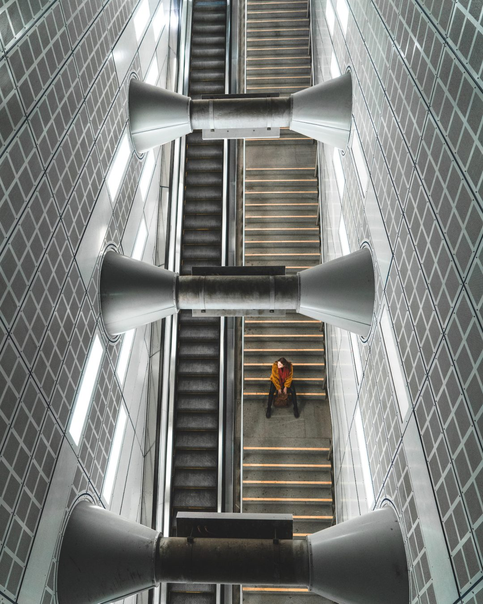

**前言，很有可能某些地方就是找不到什么很小众的，自己把控投入时间，找不到就不要找了，时间宝贵的**

## 科隆攻略

**科隆介绍**（把这个假想成我在开去科隆的路上或者到了科隆后要像一个导游一样说的几句话，在视频里要呈现出来的）

科隆是德国的第四大城市，也是莱茵地区非常重要的经济和历史中心。科隆这座城市刚有的时候，应该是我国大概汉武帝时期。二战的时候遭到很严重的破坏，但是，科隆并没有像鹿特丹那样，对城市进行大规模的现代化改造，相仿，科隆战后基本照战前原样进行了重建，科隆几乎没有摩天大楼。

**科隆的可能有好的视频和照片的地方**

1. Cologne Triangle:  这是科隆大教堂对面的一个高楼，科隆地标建筑，可以上楼拍到科隆的全景。
2. 地铁站 “Altermarkt”， Ins上有人挂出这样的图片。可以去拍照。可能人多，带上三脚架，拍延时。

## 时事热点

**这个最好就是近一周的，因为我们视频出来后还得剪辑花时间，等上片的时候时事热点可能已经过了**

举例：今天看到有一条视频爆火了。依戈猜想的[《回村三天，二舅治好了我的精神内耗》](https://www.zhihu.com/question/545268208) ，主要就是讲的一个曾经的村里天才少年如何选择了自己的人生，自己获得了真正的解放。对当代人具有一定的启示意义。 
